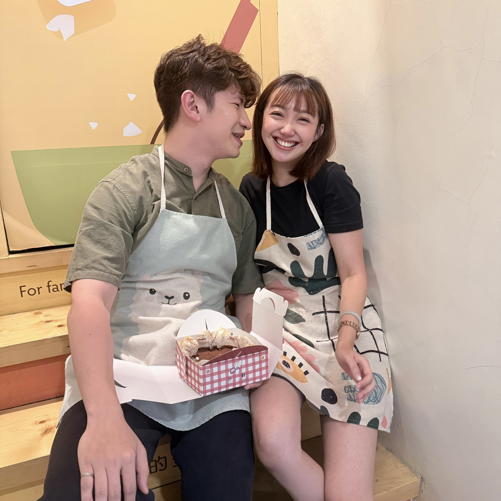

<!DOCTYPE html>
<html lang="zh-Hant">
<head>
<meta charset="UTF-8">
<meta name="viewport" content="width=device-width, initial-scale=1.0">

<title>下點小雨，也沒關係 ☂️</title>

</head>

<body>

<!-- =========================
     第一幕
========================= -->

<section class="hero">

A BIRTHDAY TRIP FOR YOU

<h1 class="reveal">
下點小雨， 
也沒關係。
</h1>

因為這次，我想跟你一起出發。

<a href="#story" class="btn reveal">
☂ 打開這份生日禮物
</a>

</section>

<!-- =========================
     故事
========================= -->

<section id="story" class="story">

FOR MY FAVORITE PERSON

<h2 class="reveal">
我想送你的， 
不是一個東西。
</h2>

而是兩天一夜。

不用趕著工作， 
不用想太多事情。

就跟我一起，離開日常一下。

</section>

<!-- =========================
     宜蘭揭曉
========================= -->

<section class="destination">

DESTINATION REVEAL

<h2 class="reveal">
那麼，去哪裡？
</h2>

一滴雨，是一個提示。

<h1>
宜蘭
</h1>

2 DAYS · 1 NIGHT

<b>STAY</b>
小雨天 VILLA

<b>DINNER</b>
小雨淋私廚

<b>MOOD</b>
慢慢來

</section>

<!-- =========================
     住宿
========================= -->

<section class="stay">

TONIGHT'S HOME

<h2 class="reveal">
今晚，這裡是我們的家。
</h2>

我想讓你住一個 
可以什麼都不用做的地方。

有田、有樹、有山。 
還有一個晚上，時間只留給我們。

<a
href="https://www.twins-villa.com/"
target="_blank"
class="btn reveal">

看看我們今晚住的地方 ↗

</a>

</section>

<!-- =========================
     晚餐
========================= -->

<section class="dinner">

A DINNER FOR TWO

<h2 class="reveal">
還有一個晚上， 
我偷偷留給你。
</h2>

DINNER

<h2>
小雨淋私廚
</h2>

不用趕著吃完， 
不用趕著回家。

就好好坐在一起， 
吃一頓只屬於我們的晚餐。

</section>

<!-- =========================
     行程
========================= -->

<section class="story">

OUR LITTLE TRIP

<h2 class="reveal">
兩天一夜，慢慢來。
</h2>

01

<strong>出發</strong> 
一起去宜蘭，看看風景、吃點好吃的。

01

<strong>入住</strong> 
把行李放下來，也把生活的忙碌放下來。

01

<strong>生日晚餐</strong> 
小雨淋私廚，今晚只管好好陪彼此。

02

<strong>睡到自然醒</strong> 
慢慢吃早餐，再一起走走。

02

<strong>回家</strong> 
把兩天的回憶一起帶回去。

</section>

<!-- =========================
     最後
========================= -->

<section class="final">

THE REAL GIFT

<h2 class="reveal">
其實我想送你的， 
從來都不是宜蘭。
</h2>

也不是民宿，也不是一頓飯。

♡

我想送你的，是我們的時間。

是兩個人一起出發， 
一起吃飯、一起看風景、一起回家的時間。

 

<h2 class="reveal">
生日快樂， 
我最愛的你。
</h2>

希望這趟旅行結束以後， 
我們還可以有很多很多個「一起出發吧」。

<a href="#story" class="btn reveal">
☂ 再看一次
</a>

</section>

</body>
</html>
